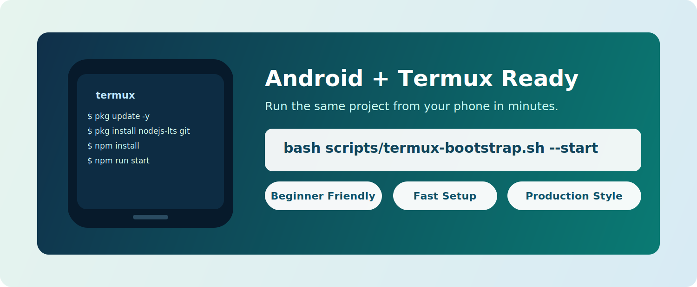
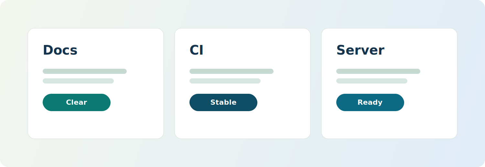

<p align="center">
  
</p>

<h1 align="center">Codex Literal Website</h1>

<p align="center">
  High-quality, beginner-friendly artifact download portal for desktop and phone users.
</p>

<p align="center">
  <a href="https://github.com/siegaarjay-hue/codex-literal-website/actions/workflows/ci.yml"></a>
  
  
  
  
</p>

<p align="center">
  <a href="#instant-start-desktop-and-phone">Instant Start</a> |
  <a href="#copy-this-to-your-ai-if-you-are-stuck">Copy to AI</a> |
  <a href="#phone-users-android--termux">Phone + Termux</a> |
  <a href="#commands">Commands</a>
</p>

---

## Instant Start (Desktop and Phone)

### Desktop (Windows, macOS, Linux)

```bash
npm install
npm run start
```

Open: `http://127.0.0.1:8000/`

Stop:

```bash
npm run stop
```

### Android + Termux

```bash
pkg update -y && pkg upgrade -y
pkg install -y nodejs-lts git
termux-setup-storage
npm install
npm run start
```

Open on your phone: `http://127.0.0.1:8000/`

Stop:

```bash
npm run stop
```

## Copy This To Your AI If You Are Stuck

Use this exact prompt:

```text
I am a beginner and starting from zero.
Repository link: https://github.com/siegaarjay-hue/codex-literal-website
My OS is: <Windows / macOS / Linux / Android with Termux>.
Assume I have NOT downloaded or cloned anything yet.

Give me exact commands and steps from start to finish.
Do not skip steps and do not send me to external docs.

Required flow:
1) install/check Git and Node.js 20+
2) clone this exact repository URL
3) cd into the cloned folder
4) run npm install
5) run npm run start
6) tell me the exact local URL to open
7) show how to stop the server (npm run stop)
8) include fixes for common errors

Output format:
- Step number
- Command to run
- What I should see if it worked
```

More prompts: `docs/AI_SETUP_PROMPTS.md`

## Visual Preview

<p align="center">
  
</p>

<p align="center">
  
</p>

<p align="center">
  
</p>

## Why This Repo Feels Professional

- Polished landing page with dynamic file list
- SHA256 metadata and copy button for integrity checks
- Resumable downloads via HTTP range support
- Background process controls (`start`, `status`, `stop`)
- CI matrix verification on Linux, macOS, and Windows
- Beginner docs for desktop and Termux users

## Phone Users (Android + Termux)

- Full guide: `docs/TERMUX.md`
- Fast setup script: `scripts/termux-bootstrap.sh`

Run it:

```bash
bash scripts/termux-bootstrap.sh
```

Optional (auto-start after setup):

```bash
bash scripts/termux-bootstrap.sh --start
```

## Commands

Install:

```bash
npm install
```

Foreground mode:

```bash
npm run serve
```

Background mode:

```bash
npm run start
npm run status
npm run stop
```

Validation:

```bash
npm test
npm run selftest
npm run check
```

## Common Fixes

`npm: command not found`
- Node.js is missing or terminal needs restart.

`EADDRINUSE` or port busy
- Use another port:
- macOS/Linux/Termux: `PORT=8080 npm run start`
- Windows PowerShell: `$env:PORT=8080; npm run start`

`Cannot find module` after updates
- Run `npm install` again.

## Cross-Platform Verification

GitHub Actions validates on:

- `ubuntu-latest`
- `macos-latest`
- `windows-latest`

Workflow: `.github/workflows/ci.yml`

## Setup Guides

- `docs/SETUP.md`
- `docs/TERMUX.md`
- `docs/AI_SETUP_PROMPTS.md`
- `docs/DESIGN_ASSETS.md`

## Security

See `SECURITY.md`.

## License

MIT (`LICENSE`).
