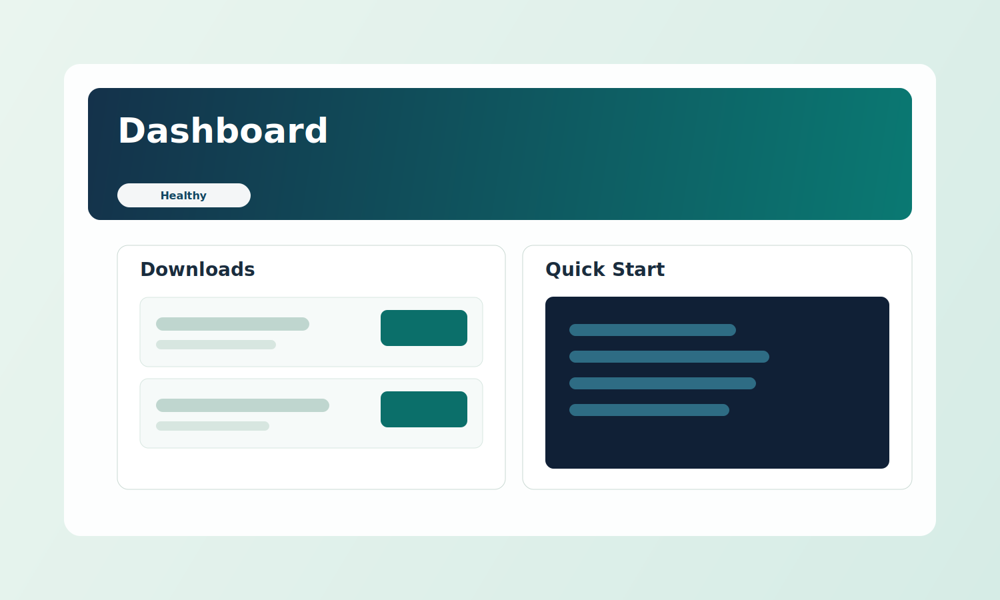

<p align="center">
  
</p>

<h1 align="center">Codex Literal Website</h1>

<p align="center">
  Beginner-friendly, cross-platform download portal for sharing release files.
</p>

<p align="center">
  <a href="https://github.com/siegaarjay-hue/codex-literal-website/actions/workflows/ci.yml"></a>
  
  
  
</p>

<p align="center">
  <a href="#start-here-2-minutes">Start Here</a> |
  <a href="#copy-this-to-your-ai-if-you-are-stuck">Copy to AI</a> |
  <a href="#commands">Commands</a> |
  <a href="#common-fixes">Common Fixes</a>
</p>

---

## Start Here (2 Minutes)

1. Install Node.js 20 or newer: https://nodejs.org
2. Open terminal in this project folder.
3. Run:

```bash
npm install
npm run start
```

4. Open `http://127.0.0.1:8000/` in your browser.
5. Put files into `downloads/`.

Stop the server when done:

```bash
npm run stop
```

Detailed OS setup: `docs/SETUP.md`

## Copy This To Your AI If You Are Stuck

Use this exact prompt:

```text
I am a beginner. Help me run the GitHub repo "codex-literal-website" on my machine.
My OS is: <Windows / macOS / Linux>.
Give exact commands only, in order, and wait after each step.
Include:
1) install/check Node.js 20+
2) open terminal in project folder
3) run npm install
4) run npm run start
5) open the local URL in browser
6) run npm run stop
7) fixes for common errors
```

More ready prompts: `docs/AI_SETUP_PROMPTS.md`

## Preview

<p align="center">
  
</p>

## Why This Is User Friendly

- Works on Linux, macOS, and Windows
- Clear command set (`start`, `status`, `stop`, `selftest`)
- Friendly download page with checksum copy button
- Resumable downloads (range support)
- CI verifies the same flows on real multi-OS runners

## Commands

Install dependencies:

```bash
npm install
```

Run in foreground:

```bash
npm run serve
```

Run in background:

```bash
npm run start
npm run status
npm run stop
```

Validation:

```bash
npm test
npm run selftest
npm run check
```

## Common Fixes

`npm: command not found`
- Install Node.js and reopen terminal.

`EADDRINUSE` / port already in use
- Change port:
- macOS/Linux: `PORT=8080 npm run start`
- Windows PowerShell: `$env:PORT=8080; npm run start`

`Cannot find module` after pulling new code
- Run `npm install` again.

## Cross-Platform Verification

GitHub Actions validates:

- `ubuntu-latest`
- `macos-latest`
- `windows-latest`

Workflow file: `.github/workflows/ci.yml`

## Project Structure

- `downloads/` - place files to share
- `index.html` - web page shell
- `assets/` - styles and frontend logic
- `scripts/` - server and CLI
- `tests/` - automated test suite

## Security

See `SECURITY.md`.

## License

MIT (`LICENSE`).
