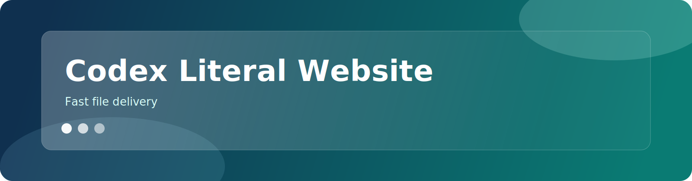

<p align="center">
  
</p>

# Codex Literal Website

[](https://github.com/siegaarjay-hue/codex-literal-website/actions/workflows/ci.yml)

Cross-platform download server for sharing release files with SHA256 checksums, resumable downloads, and health/self-test verification.

## Quick Start (Desktop)

```bash
git clone https://github.com/siegaarjay-hue/codex-literal-website.git
cd codex-literal-website
npm install
npm run start
```

Open `http://127.0.0.1:8000/`.

Stop:

```bash
npm run stop
```

## Quick Start (Android + Termux)

```bash
pkg update -y && pkg upgrade -y
pkg install -y git nodejs-lts
termux-setup-storage
git clone https://github.com/siegaarjay-hue/codex-literal-website.git
cd codex-literal-website
npm install
npm run start
```

Open `http://127.0.0.1:8000/` on your phone browser.

Stop:

```bash
npm run stop
```

## Copy-Paste Prompt For AI Agent

Use this when you want AI to do setup directly, not just explain.

```text
You are an autonomous setup agent with terminal access.
Do setup yourself end-to-end. Do NOT ask me to run commands manually unless permissions block you.

Repository link: https://github.com/siegaarjay-hue/codex-literal-website
OS: <Windows / macOS / Linux / Android with Termux>
Assume repo is not cloned yet.

Required actions:
1) install/check Git and Node.js 20+
2) clone repository
3) cd into repo
4) npm install
5) npm run start
6) verify GET /healthz
7) run npm run selftest
8) report final URL
9) show stop command: npm run stop

If any command fails, fix it and continue.
```

More prompts: `docs/AI_SETUP_PROMPTS.md`

## Commands

```bash
npm run serve      # foreground server
npm run start      # background server
npm run status     # check status
npm run stop       # stop background server
npm run selftest   # end-to-end validation
npm test           # unit tests
npm run check      # test + selftest
```

## Troubleshooting

`npm: command not found`
- Install Node.js 20+ and reopen terminal.

`EADDRINUSE` (port busy)
- macOS/Linux/Termux: `PORT=8080 npm run start`
- Windows PowerShell: `$env:PORT=8080; npm run start`

`Cannot find module`
- Run `npm install` again.

## Docs

- `docs/SETUP.md`
- `docs/TERMUX.md`
- `docs/AI_SETUP_PROMPTS.md`
- `docs/DESIGN_ASSETS.md`

## Security

See `SECURITY.md`.

## License

MIT (`LICENSE`).
